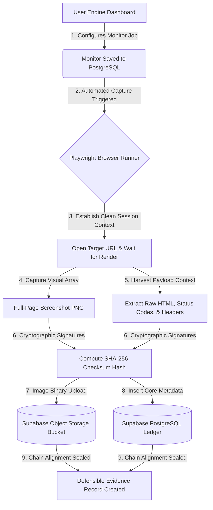

# VeritasWeb

### *Automated Forensic Web Capture Platform for Legal Evidence Preservation*

[](LICENSE)
[](https://nextjs.org)
[](https://www.typescriptlang.org)
[](https://supabase.com)
[](https://playwright.dev)

---

## 📖 Overview

Web content is ephemeral, dynamic, and fragile. Traditional methods of preserving digital evidence—such as simple screenshots or basic browser "Print to PDF" utilities—are completely inadequate for legal disputes, regulatory audits, or forensic investigations. They lack verifiable metadata, fail to maintain a chain of custody, and are highly vulnerable to client-side DOM manipulation or digital tampering.

**VeritasWeb** is a forensic-style LegalTech MVP for programmatically capturing, preserving, and reviewing web-based evidence records. By generating cryptographic hashes and storing capture metadata at the point of capture, VeritasWeb helps create an evidence preservation record that can be reviewed even if the original target website changes or disappears.

### The Problem it Solves
Manual screenshots lack an audit trail and cannot mathematically prove that an asset wasn't altered post-capture. VeritasWeb automates this process entirely, binding headless browser automation output directly to cryptographic proofs to prevent evidence repudiation.

### Who it is For
* **Lawyers & Law Firms:** To preserve structured records of online defamation, patent/trademark infringement, and public declarations.
* **Compliance & Risk Teams:** To build unalterable, automated historical logs of pricing structures, terms of service updates, or regulatory disclosures.
* **Journalists & Investigators:** To establish permanent, timestamped records of investigative sources and web-based stories before deletion.
* **Digital Forensics Professionals:** To acquire pristine, isolated captures containing raw HTTP responses, status codes, and full-page rendering structures.

---

## 🚀 Features

* 🔒 **Secure Multi-Tenant Auth:** Fully configured user registration, login, and protected routing states utilizing Supabase Auth and strict JWT verification.
* 🤖 **Playwright Automation Engine:** Spawns detached, automated headless browser instances to open target websites, wait for complete asynchronous page rendering, and capture full-page screenshots along with raw HTML source code and text data titles.
* 🖥️ **Granular Monitor Management:** Complete CRUD workflow allowing users to set up continuous website monitors tracking specific URLs (with integrated validation and string normalization via Zod) across customized frequencies (Hourly, Daily, Weekly).
* 🛡️ **Forensic Cryptographic Ledger:** Computes deterministic `SHA-256` payload signatures instantly upon capture to verify data authenticity and execute real-time tamper-detection auditing.
* 🗄️ **Decoupled Cloud Infrastructure:** Visual screenshot assets are securely offloaded to dedicated Supabase Storage buckets, while structural metadata logs (HTTP headers, status codes, timestamps, and backward-linking hashes) are locked inside a PostgreSQL instance.

---

## 🛠️ Tech Stack

### Frontend & Dashboard
* **Framework:** Next.js 15 (App Router architecture, React Server Components)
* **Language:** TypeScript
* **Styling Engine:** Tailwind CSS
* **Component Library:** Shadcn UI

### Backend Architecture
* **API Framework:** Next.js API Route Handlers
* **Browser Automation:** Playwright Core
* **Validation Layer:** Zod Schemas

### Database & Security Layers
* **Database Engine:** PostgreSQL (Managed via Supabase)
* **Authentication & Security:** Supabase Auth with Row Level Security (RLS) policies
* **Object Cloud Storage:** Supabase Storage
* **Cryptography Modules:** Native Node.js Crypto Engine (`SHA-256` hashing algorithms)

---

## 📐 System Architecture & Workflow

VeritasWeb decouples user interaction, automated task queuing, and the secure storage layer to safeguard digital evidence against localized tampering.

### Current Evidence Workflow



## ⚙️ Installation

Follow these instructions to clone, configure, and execute an isolated development instance of VeritasWeb locally.

### Prerequisites
* **Node.js:** Version `18.x.x` or higher
* **Package Manager:** npm
* **Supabase Instance:** a Supabase project with PostgreSQL, Auth, and Storage enabled

### Setup Instructions

1. **Clone the core project:**
   ```bash
   git clone [https://github.com/Shri-222/VeritasWeb.git](https://github.com/Shri-222/VeritasWeb.git)
   cd VeritasWeb
   ```

2. **Install Base Application Dependencies:**
   ```bash
   npm install
   ```

3. **Install Playwright Headless Browser Core Binaries:**
   Download and configure the clean chromium environments required for isolation rendering:
   ```bash
   npx playwright install chromium
   # or
   npm run postinstall:playwright
   ```

4. **Configure Local Environment Variables:**
   Copy `.env.example` to `.env.local` and fill in the Supabase values. Keep `.env.local` uncommitted because it contains server-only secrets.

5. **Initialize Platform Development Host Engine:**
   ```bash
   npm run dev
   ```
   Open your browser space and navigate to http://localhost:3000 to interact with your dashboard workspace.

## Environment Variables
   To bind your authentication endpoints and cloud storage matrices securely to your backend application, populate your root execution files using this template block:

   ```bash
   NEXT_PUBLIC_SUPABASE_URL=[https://your-supabase-project-id.supabase.co](https://your-supabase-project-id.supabase.co)
   NEXT_PUBLIC_SUPABASE_ANON_KEY=eyJhbGciOiJIUzI1NiIsInR5cCI6IkpXVCJ9...

   SUPABASE_SERVICE_ROLE_KEY=eyJhbGciOiJIUzI1NiIsInR5cCI6IkpXVCJ9...
   SUPABASE_JWT_SECRET=your-supabase-jwt-generated-secret-string-phrase

   # Optional documentation value; the current capture API uses "captures".
   SUPABASE_STORAGE_BUCKET=captures
   ```

   `NEXT_PUBLIC_*` values are browser-safe Supabase project settings. `SUPABASE_SERVICE_ROLE_KEY` and `SUPABASE_JWT_SECRET` are server-only secrets and must never be exposed in client code or committed to git.

## Supabase Storage Security Note

The current capture upload path uses a Supabase Storage bucket named `captures`.
For MVP safety, configure this bucket as private. Screenshots should not be
publicly readable unless a later signed URL flow is implemented. Storage
policies should prevent users from reading screenshots for monitors they do not
own.
Create the `captures` bucket before running manual captures. The Phase 3 capture
pipeline stores both `screenshot.png` and `page.html` artifacts under a
user/monitor/timestamp object path.

## Capture Pipeline

Authenticated users can create a monitor and trigger `Capture Now` from the
dashboard. The server revalidates monitor ownership, rechecks the URL for basic
SSRF safety, launches Playwright Chromium, captures a full-page screenshot and
raw HTML, uploads both artifacts to the private `captures` bucket, and inserts
metadata into PostgreSQL.

Each Phase 3 capture stores separate SHA-256 hashes for the screenshot and HTML.
It also stores a deterministic manifest hash over the artifact paths, artifact
hashes, URL metadata, status code, headers, capture timestamp, and previous
capture hash. For backward compatibility, `storage_url` points to the screenshot
path and `sha256_hash` stores the manifest hash.

## Integrity Verification

Capture detail pages let authenticated users inspect stored metadata and run an
integrity verification check. Verification downloads the private screenshot and
HTML artifacts server-side, recomputes their SHA-256 hashes, rebuilds the same
deterministic evidence manifest, and compares the computed hashes with the
stored database values.

Verification confirms that the stored artifacts still match the stored hashes
and manifest metadata. It does not automatically guarantee court admissibility,
replace legal chain-of-custody procedures, or act as an external timestamp
authority. Screenshot previews use short-lived signed URLs; the underlying
`captures` bucket should remain private.

## Server Role Usage Note

Normal user-scoped monitor and capture listing routes should use the
authenticated Supabase client so PostgreSQL RLS remains active. The service role
client is reserved for server-only artifact work after ownership has already
been verified, such as uploading screenshots and HTML during capture, generating
short-lived screenshot signed URLs for owned captures, and downloading stored
artifacts during integrity verification.

## Database Schema Overview

   The platform maintains two primary target tables within PostgreSQL, strictly enforced through Row Level Security (RLS) conditions to ensure complete multi-tenant tenant data isolation.

   ### monitors Table
      Stores targeted website tracking jobs assigned by consumers.

      
